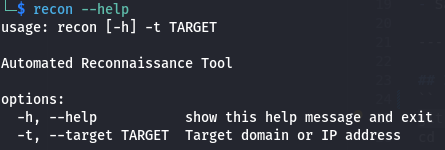
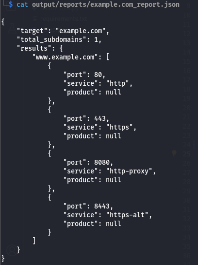

# Recon Tool

**Recon Tool** is a Python-based automated reconnaissance utility designed to perform initial attack surface mapping for a target domain.

It automates subdomain discovery, port scanning, and service identification, and generates structured reports to support penetration testing and security analysis.

This tool is intended for **educational purposes, security labs, and authorized reconnaissance only**.

---

## Overview

In a typical penetration testing workflow, reconnaissance is the first phase.
This tool helps security professionals quickly identify:

* External attack surface
* Exposed services
* Potential entry points

It combines multiple reconnaissance steps into a single command-line utility.

---

## Security Context

* This tool simulates the reconnaissance phase of a real-world VAPT engagement.
* It is designed to automate asset discovery and exposure analysis, helping security professionals identify potential attack surfaces before vulnerability assessment.

---

## Features

* Subdomain enumeration using Sublist3r
* Fast web-focused port scanning
* Service detection using Nmap
* Nmap XML parsing
* Structured JSON report generation
* Simple CLI interface
* Isolated installation using pipx

---

## Tech Stack

* Python 3.9+
* Nmap
* Sublist3r
* pipx
* Linux (Kali Linux recommended)

---

## Installation (Recommended)

### 1. Install dependencies

```bash
sudo apt update
sudo apt install nmap sublist3r pipx -y
pipx ensurepath
```

Restart your terminal after this step.

---

### 2. Clone the repository

```bash
git clone https://github.com/Omini05/recon_tool.git
cd recon_tool
```

---

### 3. Install the tool

```bash
pipx install .
```

This installs the tool in an isolated environment and registers the command globally.

---

### 4. Verify installation

```bash
recon --help
```

---

## Usage

```bash
recon -t <target>
```

Example:
```bash
recon -t example.com
```

---

## Workflow

When executed, the tool performs:

1. Subdomain enumeration
2. Port scanning on discovered assets
3. Service detection using Nmap
4. XML parsing and data extraction
5. JSON report generation

---

## Output

Reports are saved in:

```
output/reports/<target>_report.json
```

Sample report structure:



---

## Project Structure

```
recon_tool/
├── modules/
│   ├── subdomain_enum.py
│   ├── port_scan.py
│   ├── xml_parser.py
│   └── report.py
├── recon_tool.py
├── setup.py
├── requirements.txt
└── README.md
```

---

## Use Cases

* Recon phase of VAPT engagements
* Attack surface mapping
* Security lab practice
* Learning automation in cybersecurity

---

## Disclaimer

This tool is intended only for **authorized security testing and educational use**.
Do not scan systems or networks without proper permission.
The author is not responsible for misuse.

---

## Future Improvements
- Add directory brute-force
- Add vulnerability scanning
- Add multi-threading

---

## Author

**Omini Vishwakarma**
Cyber Security Engineering Student
